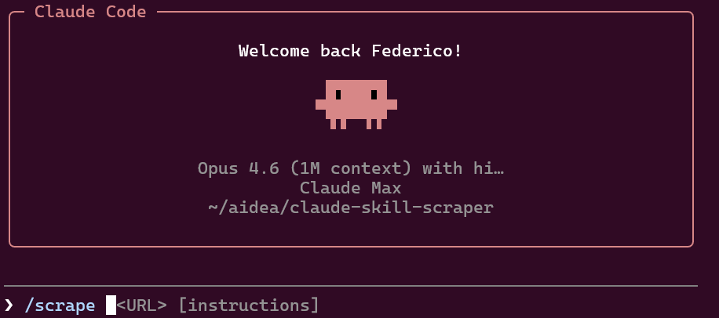

# /scrape

**A Claude Code skill to reverse-engineer any website's API and generate a working Python scraper.**

Point Claude at a URL, tell it what data you need, and it will intercept network traffic, discover the hidden APIs, document them, and generate a self-contained Python scraper you can rerun anytime.

Built as a native [Claude Code](https://docs.anthropic.com/en/docs/claude-code) skill — install it from the plugin marketplace and use it directly in your terminal.

## Quick Start

Inside Claude Code:

```
/plugin marketplace add aidea-team/claude-skill-scraper
/plugin install scraper@aidea-tools
```

## Usage

```
/scrape <URL> [instructions]
```

The URL is required. Everything after it is free-text instructions for Claude — what to scrape, credentials, filters, anything relevant.

```bash
# Scrape everything from a page
/scrape https://example.com/products

# Tell Claude exactly what you need
/scrape https://example.com/products only in-stock items, I need name + price + SKU

# Provide credentials for authenticated sites
/scrape https://portal.example.com user: demo@test.com pass: demo123

# Focus on a specific API
/scrape https://example.com/dashboard focus on the /api/v2/listings endpoint
```

## How It Works

Claude runs a fully automated 6-step workflow — you just watch and approve the final run.

| Step | What Claude does |
|------|-----------------|
| **Network recon** | Launches headless Chromium, captures all HTTP traffic, identifies data-carrying API endpoints |
| **Visual recon** | Screenshots the page, extracts DOM structure, detects framework (React, Angular, WordPress...) |
| **API analysis** | Tests endpoints with curl — maps auth, pagination, filters, rate limits |
| **Documentation** | Writes `reverse_engineered_api.md` with full endpoint specs |
| **Scraper generation** | Produces a single-file Python script with CLI, pagination, and JSON output |
| **Test & iterate** | Runs `--dry-run`, fixes issues, proposes full run for your approval |

## Output

The skill creates a `{sitename}_scraper/` directory:

```
example_scraper/
├── example_scraper.py           # The scraper — standalone, only needs `requests`
├── example_scraper_docs.md      # Usage docs
├── reverse_engineered_api.md    # API documentation
└── example_data.json            # Scraped data (after full run)
```

The generated scraper is **self-contained** — one Python file, depends only on `requests`, no browser needed at runtime. Run it again anytime:

```bash
python example_scraper.py                    # Full scrape
python example_scraper.py --dry-run          # Test connectivity
python example_scraper.py --max-items 10     # Limited test run
```

## Requirements

- [Claude Code](https://docs.anthropic.com/en/docs/claude-code) CLI
- Python 3.9+
- Everything else (Playwright, Chromium) is installed automatically in an isolated venv

## Permissions

On first run, Claude Code will prompt you to approve bash commands, file writes, etc.

For a smoother experience, allow the needed tools upfront:

```
/allowed-tools Bash(pip install *) Bash(playwright install *) Bash(python3 *) Bash(curl *) Bash(mkdir *) Write Edit Read
```

Or skip all prompts for a session:

```bash
claude --dangerously-skip-permissions
```

## License

MIT
